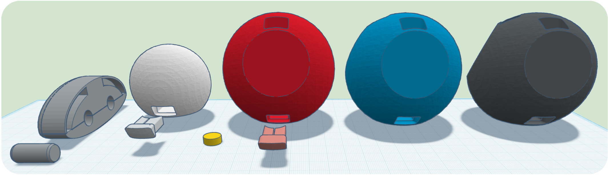

# Magnetic Atomic Model
STL files for magnetic atoms educational resource

The included STL files contain all the parts you need to print.
For each atom, print the sphere and the corresponding lids in the specified color (see the table below for details).
Before placing the lid on the sphere, insert the appropriate magnet.
Double and triple bonds are printed in two halves and joined using two connecting cylinders. If the fit is a bit loose you can adjust it by inserting a small piece of paper in between.

**[ Magnet Type ]**

When printing the models at the default size the neodymium magnets should be 10x4 mm (a little bigger or smaller should be fine as well), however make sure to only use diametral magnetization type, otherwise some parts will repel each other instead of sticking together.

**[ STL Files ]**

The <a href="STL">STL folder</a> contains the required files for each component:

| Element  | Color | Magnets | Parts |
| -------- | ----- | ------- | ----- |
| d/t bond | Gray  | 2       | 2+2   |
| Hydrogen | White | 1       | 1+1   |
| Oxygen   | Red   | 2       | 1+2   |
| Nitrogen | Blue  | 3       | 1+3   |
| Carbon   | Black | 4       | 1+4   |

**[ Demo video ]**

Video showing the project and the instructions to create the magnetic atoms:

https://www.youtube.com/watch?v=XXXXXXXX
